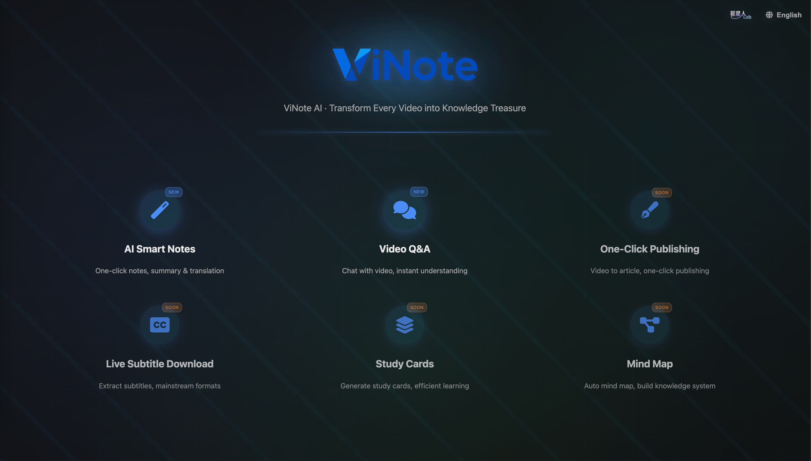

<div align="center">


**ViNote = Video + Note**

ViNote AI · Turn Every Video into Your Knowledge Asset

**Video to Everything: Notes, Q&A, Articles, Subtitles, Cards, Mind Maps - All in One**

[](https://www.python.org/downloads/)
[](https://fastapi.tiangolo.com/)
[](https://www.docker.com/)
[](https://opensource.org/licenses/MIT)

English | [中文文档](README_ZH.md)

</div>

---



## ✨ Core Features

### 🎯 Intelligent Video Processing
- **Multi-Platform Support**: YouTube, Bilibili, and other major video platforms
- **Local Video Support**: Support for local video file path input (MP4, AVI, MOV, MKV, etc.)
- **High-Quality Transcription**: Local audio transcription based on Faster-Whisper
- **Smart Optimization**: AI-driven text optimization and formatting
- **Multi-Language Support**: Automatic language detection and translation

### 📝 Note Generation
- **Structured Output**: Automatically generate outlines, key points, and summaries
- **Markdown Format**: Perfect compatibility with all note-taking apps
- **Real-Time Progress**: SSE real-time progress updates
- **Batch Processing**: Support for concurrent multi-task processing

### 🤖 Video Q&A
- **Intelligent Q&A**: AI Q&A system based on video content
- **Context Understanding**: Deep comprehension of video content

### 🔍 AI Video Search (ViNoter Super Search) 🔥
- **Cross-Platform Search**: Built on [Apple's ANP Protocol](https://github.com/apple/live-caller-id-lookup-example), supports Bilibili, YouTube video search
- **Intelligent Conversation**: Natural language interaction, automatically understands user intent
- **Auto Note Generation**: Automatically generates notes after selecting videos
- **Streaming Progress**: Real-time progress display with SSE

### 🎬 Video Download
- **Multi-Format Support**: Support for various video formats and resolutions
- **Preview Feature**: Preview video information before downloading
- **Progress Tracking**: Real-time download progress display

---

## 🚀 Quick Start

### Method 1: Docker Deployment (Recommended)

#### Prerequisites
- Docker 20.10+
- Docker Compose 2.0+

#### Deployment Steps

1. **Clone the Project**
```bash
git clone https://github.com/zrt-ai-lab/ViNote.git
cd ViNote
```

2. **Configure Environment Variables**
```bash
# Copy environment configuration file
cp .env.example .env

# Edit .env file and add your OpenAI API Key
# OPENAI_API_KEY=your-api-key-here
# OPENAI_BASE_URL=https://api.openai.com/v1
# OPENAI_MODEL=gpt-4o
```

3. **Start Services**
```bash
# Build and start
docker-compose up -d

# View logs
docker-compose logs -f

# Stop services
docker-compose down
```

> 💡 **Image Acceleration Tip**:
> 
> The Dockerfile is configured to use Tsinghua University mirrors for faster package downloads:
> - Debian package sources: `mirrors.tuna.tsinghua.edu.cn`
> 
> This will significantly improve build speed for users in China. If you want to use other mirrors (like Alibaba Cloud, USTC, etc.), you can modify the mirror addresses in the Dockerfile.

4. **Access Application**
Open your browser and visit: http://localhost:8000

---

### Method 2: Local Development

#### Prerequisites
- Python 3.10+
- FFmpeg (for audio/video processing)
- uv package manager

#### Installation Steps

1. **Clone the Project**
```bash
git clone https://github.com/zrt-ai-lab/ViNote.git
cd ViNote
```

2. **Install uv Package Manager**
```bash
# macOS/Linux
curl -LsSf https://astral.sh/uv/install.sh | sh

# Windows
powershell -c "irm https://astral.sh/uv/install.ps1 | iex"
```

3. **Install FFmpeg**
```bash
# macOS
brew install ffmpeg

# Ubuntu/Debian
sudo apt-get update && sudo apt-get install ffmpeg

# Windows
# Download and install from https://ffmpeg.org/download.html
```

4. **Install Dependencies**
```bash
# Install dependencies using uv (will automatically create .venv virtual environment)
uv pip install -e .

# Or use uv sync (recommended)
uv sync
```

5. **Configure Environment Variables**
```bash
cp .env.example .env
# Edit .env file with your configuration
```

6. **Start Services**

Two ways to start the service:

**Method 1: Using uv run (Recommended, no need to activate virtual environment)**
```bash
# Development mode (with auto-reload)
uv run uvicorn backend.main:app --reload --port 8000

# Production mode
uv run uvicorn backend.main:app --host 0.0.0.0 --port 8000 --workers 4
```

**Method 2: Activate virtual environment first**
```bash
# Activate virtual environment
source .venv/bin/activate  # macOS/Linux
# or
.venv\Scripts\activate     # Windows

# Then start the service
uvicorn backend.main:app --reload --port 8000
```

7. **Access Application**
Open your browser and visit: http://localhost:8000

---

## 📖 User Guide

### Video to Notes

#### Method 1: Online Video URL
1. Open the application homepage and select "AI Video Notes"
2. In "Online URL" mode, paste video link (supports YouTube, Bilibili, etc.)
3. Click "Preview" to view video information
4. Select summary language (Chinese/English/Japanese and 11 languages)
5. Click "Generate Notes"
6. Wait for completion (view real-time progress)
7. Download generated Markdown notes

#### Method 2: Local Video File
1. Open the application homepage and select "AI Video Notes"
2. Switch to "Local Path" mode
3. Enter the absolute path of your local video file, for example:
   - Mac/Linux: `/Users/zhangsan/Videos/lecture.mp4`
   - Windows: `C:\Users\zhangsan\Videos\lecture.mp4`
   - Docker: `/app/videos/lecture.mp4` (requires mounted directory)
4. Click "Preview" to verify the file
5. Select summary language
6. Click "Generate Notes"
7. Wait for completion and download notes

> 💡 **Supported Video Formats**: MP4, AVI, MOV, MKV, MP3, WAV, etc.

### Video Q&A

#### Method 1: Online Video URL
1. Open the application homepage and select "AI Video Q&A"
2. In "Online URL" mode, paste video link (supports YouTube, Bilibili, etc.)
3. Click "Preview" to view video information
4. Click "Start Preprocessing" button
5. Wait for AI preprocessing to complete (extract audio and transcribe)
6. Enter your question in the input box
7. AI will answer in real-time based on video content

#### Method 2: Local Video File
1. Open the application homepage and select "AI Video Q&A"
2. Switch to "Local Path" mode
3. Enter the absolute path of your local video file
4. Click "Preview" to verify the file
5. Click "Start Preprocessing" button
6. Wait for AI preprocessing to complete
7. Enter questions in the input box, AI answers in real-time

> 💡 **Tip**: After preprocessing is complete, you can ask any questions about the video content, and AI will provide accurate answers based on the complete video content

### Video Download

1. Select "Video Download" tab
2. Paste video link and click "Preview"
3. Choose desired video quality
4. Click "Start Download"
5. Save file after download completes

---

## 🏗️ Project Architecture

```
vinote/
├── backend/              # Backend code
│   ├── config/          # Configuration management
│   │   ├── ai_config.py      # AI model configuration
│   │   └── settings.py       # Application settings
│   ├── core/            # Core functionality
│   │   └── ai_client.py      # AI client singleton
│   ├── models/          # Data models
│   │   └── schemas.py        # Pydantic models
│   ├── services/        # Business logic layer
│   │   ├── note_generator.py        # Note generation
│   │   ├── content_summarizer.py    # Content summarization
│   │   ├── text_optimizer.py        # Text optimization
│   │   ├── text_translator.py       # Text translation
│   │   ├── audio_transcriber.py     # Audio transcription
│   │   ├── video_downloader.py      # Video download
│   │   ├── video_preview_service.py # Video preview
│   │   ├── video_download_service.py # Download service
│   │   └── video_qa_service.py      # Video Q&A
│   ├── utils/           # Utility functions
│   │   ├── file_handler.py   # File handling
│   │   └── text_processor.py # Text processing
│   └── main.py          # FastAPI application entry
├── static/              # Frontend static files
│   ├── index.html       # Main page
│   ├── app.js          # Frontend logic
│   └── *.png/jpg       # Image resources
├── temp/               # Temporary files directory
│   ├── downloads/      # Downloaded files
│   └── backups/        # Task backups
├── .env.example        # Environment variables example
├── pyproject.toml      # Project configuration (uv)
├── Dockerfile          # Docker image configuration
├── docker-compose.yml  # Docker compose configuration
└── README.md          # Project documentation
```

---

## 🔧 Configuration

### Environment Variables

| Variable | Description | Default | Required |
|----------|-------------|---------|----------|
| `OPENAI_API_KEY` | OpenAI API Key | - | ✅ |
| `OPENAI_BASE_URL` | OpenAI API Base URL | `https://api.openai.com/v1` | ✅ |
| `OPENAI_MODEL` | Model to use | `gpt-4o` | ✅ |
| `WHISPER_MODEL_SIZE` | Whisper model size | `base` | ✅ |
| `APP_HOST` | Service listening address | `0.0.0.0` | ❌ |
| `APP_PORT` | Service port | `8001` | ❌ |

### Whisper Model Selection

| Model | Parameters | GPU VRAM (fp16) | CPU RAM (int8) | Speed | Quality | Use Case |
|-------|------------|-----------------|----------------|--------|---------|----------|
| `tiny` | 39M | ~1GB | ~600MB | ⚡⚡⚡⚡⚡ | ⭐⭐ | Quick testing, real-time transcription |
| `base` | 74M | ~1GB | ~800MB | ⚡⚡⚡⚡ | ⭐⭐⭐ | Balanced choice ✅ |
| `small` | 244M | ~2GB | ~1.5GB | ⚡⚡⚡ | ⭐⭐⭐⭐ | Medium quality |
| `medium` | 769M | ~3-4GB | ~2.5GB | ⚡⚡ | ⭐⭐⭐⭐ | High quality |
| `large-v1` | 1550M | ~4.5GB | ~3GB | ⚡ | ⭐⭐⭐⭐⭐ | Highest quality (legacy) |
| `large-v2` | 1550M | ~4.5GB | ~2.9GB | ⚡ | ⭐⭐⭐⭐⭐ | Highest quality |
| `large-v3` / `large` | 1550M | ~4.5GB | ~3GB | ⚡ | ⭐⭐⭐⭐⭐ | Highest quality (recommended) |
| `turbo` / `large-v3-turbo` | ~809M | ~3GB | ~2GB | ⚡⚡ | ⭐⭐⭐⭐⭐ | High quality fast version |
| `distil-small.en` | ~166M | ~1.5GB | ~1GB | ⚡⚡⚡⚡ | ⭐⭐⭐ | English fast transcription |
| `distil-medium.en` | ~394M | ~2.5GB | ~1.8GB | ⚡⚡⚡ | ⭐⭐⭐⭐ | English medium quality |
| `distil-large-v2` | ~756M | ~3.5GB | ~2.5GB | ⚡⚡ | ⭐⭐⭐⭐⭐ | Distilled high quality |
| `distil-large-v3` | ~756M | ~3.5GB | ~2.5GB | ⚡⚡ | ⭐⭐⭐⭐⭐ | Distilled latest |

---

## 🛠️ Development Guide

### uv Package Manager Commands

```bash
# Install dependencies
uv sync

# Add new dependency
uv add package-name

# Add development dependency
uv add --dev package-name

# Update dependencies
uv lock --upgrade

# Run script
uv run python script.py
```

### Docker Commands

```bash
# Build image
docker-compose build

# Start services
docker-compose up -d

# View logs
docker-compose logs -f vinote

# Enter container
docker-compose exec vinote bash

# Stop services
docker-compose down

# Complete cleanup (including volumes)
docker-compose down -v
```

### API Endpoints

Complete API documentation: http://localhost:8000/docs

Main endpoints:
- `POST /api/process-video` - Process video to generate notes
- `GET /api/task-status/{task_id}` - Query task status
- `GET /api/task-stream/{task_id}` - SSE task progress stream
- `POST /api/video-qa-stream` - Video Q&A streaming interface
- `GET /api/preview-video` - Preview video information
- `POST /api/start-download` - Start video download
- `GET /api/download/{filename}` - Download generated files

---

## 📋 Version History

### v1.1 (2025-01-27)
#### 🎉 New Features
- ✅ **Local Video Support**: Support for local video file input via absolute path
  - Supported formats: MP4, AVI, MOV, MKV, MP3, WAV, etc.
  - Support for Mac/Linux/Windows paths
  - Docker environment supports directory mounting
- ✅ **Video Notes Local Mode**: Process local videos directly to generate notes
- ✅ **Video Q&A Local Mode**: Intelligent Q&A based on local video content

#### 🔧 Improvements
- Optimized path validation logic
- Improved user interface experience
- Enhanced documentation

### v1.0 (2025-01-20)
#### 🎉 Initial Release
- ✅ Online video download and transcription
- ✅ AI-driven note generation
- ✅ Video Q&A system
- ✅ Video download functionality
- ✅ Multi-language support
- ✅ Real-time progress tracking

---

## 🗺️ Roadmap

### ✅ Completed Features

#### Core Features
- ✅ Video audio download and transcription
- ✅ AI-driven note generation
- ✅ Intelligent text optimization
- ✅ Multi-language translation support
- ✅ Video Q&A system
- ✅ Video download functionality


### 🚧 Upcoming Modules (4/6)

#### Module 3️⃣: One-Click Content Publishing
- 🔲 Video content to article
- 🔲 Multi-platform publishing (WeChat, Zhihu, Xiaohongshu, etc.)
- 🔲 Custom publishing templates


#### Module 4️⃣: Real-Time Subtitle Download
- 🔲 Extract video subtitles
- 🔲 Multi-format support (SRT, VTT, ASS, etc.)


#### Module 5️⃣: Knowledge Card Generation
- 🔲 Automatically extract knowledge points
- 🔲 Generate study cards


#### Module 6️⃣: Mind Map Generation
- 🔲 Automatically generate mind maps
- 🔲 Multiple mind map styles


---

## 🤝 Contributing

Contributions are welcome! Please follow these steps:

1. Fork this repository
2. Create a feature branch (`git checkout -b feature/AmazingFeature`)
3. Commit your changes (`git commit -m 'Add some AmazingFeature'`)
4. Push to the branch (`git push origin feature/AmazingFeature`)
5. Open a Pull Request

### Contribution Suggestions
- 📋 Check the [Roadmap](#🗺️-roadmap) to select features to develop
- 🐛 Fix bugs in Issues
- 📝 Improve documentation and examples
- ✨ Propose new feature ideas

---

## 📄 License

This project is licensed under the MIT License - see the [LICENSE](LICENSE) file for details

---

## 🙏 Acknowledgments

This project is built upon the following excellent open-source projects and services:

### Core Dependencies
- **[yt-dlp](https://github.com/yt-dlp/yt-dlp)** - Powerful video download tool supporting hundreds of video platforms
- **[Faster-Whisper](https://github.com/SYSTRAN/faster-whisper)** - Efficient Whisper implementation with excellent transcription performance
- **[FastAPI](https://github.com/tiangolo/fastapi)** - Modern Python web framework, high-performance and easy to use
- **[OpenAI API](https://openai.com/)** - Powerful AI text processing capabilities

### Inspiration
- **[AI-Video-Transcriber](https://github.com/wendy7756/AI-Video-Transcriber)** - An open-source AI video transcription and summarization tool that provided important design inspiration for this project

### Other Tools
- **[uv](https://github.com/astral-sh/uv)** - Blazingly fast Python package manager
- **[Docker](https://www.docker.com/)** - Containerized deployment platform
- **[Pydantic](https://github.com/pydantic/pydantic)** - Data validation and configuration management

Thanks to all open-source contributors! 💖

---

## 💬 Contact

- Issue Feedback: [GitHub Issues](https://github.com/zrt-ai-lab/ViNote/issues)
- Email: 864410260@qq.com

---

<div align="center">

**If this project helps you, please give it a ⭐️ Star!**

Made with ❤️ by ViNote Team

</div>
