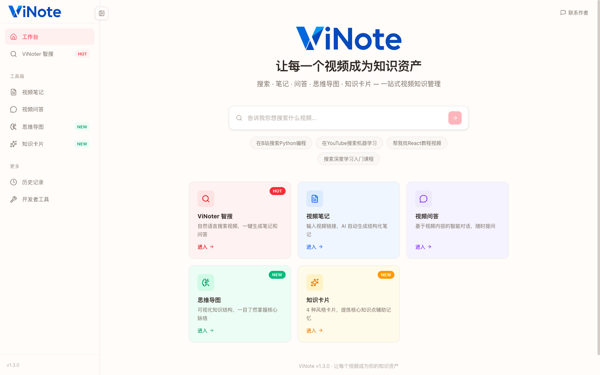

<div align="center">


**ViNote = Video + Note**

**视记AI · 让每个视频成为你的知识资产**

ViNoter · 超级视记Agent

**Video to Everything：笔记、问答、文章、字幕、卡片、导图，一应俱全**

[](https://www.python.org/downloads/)
[](https://fastapi.tiangolo.com/)
[](https://opensource.org/licenses/MIT)
</div>

---



## ✨ 核心特性

### 🤖 ViNoter 超级智能体 🔥
- **对话式操作**: 通过自然语言对话完成所有视频处理任务
- **智能意图理解**: 自动识别用户需求，无需手动切换功能
- **跨平台搜索**: 支持 B站、YouTube 等多平台视频检索
- **流程自动化**: 搜索→转录→笔记→翻译，一气呵成
- **基于 ANP 协议**: 全球领先开源的去中心化 Agent 协作标准


### 🎯 智能视频处理
- **多平台支持**: YouTube, Bilibili等主流视频平台
- **本地视频支持**: 支持本地视频文件路径输入（MP4, AVI, MOV, MKV等格式）
- **高质量转录**: 基于 Faster-Whisper 的本地音频转录
- **智能优化**: AI驱动的文本优化和格式化
- **多语言支持**: 自动检测语言并支持翻译

### 📝 笔记生成
- **结构化输出**: 自动生成大纲、要点和总结
- **Markdown格式**: 完美支持各类笔记软件
- **实时进度**: SSE实时推送处理进度

### 🤖 视频问答
- **智能问答**: 基于视频内容的AI问答系统
- **上下文理解**: 深度理解视频内容
- **流式输出**: 实时响应，提升用户体验

### 🎬 视频下载
- **多格式支持**: 支持多种视频格式和分辨率
- **预览功能**: 下载前预览视频信息
- **进度跟踪**: 实时显示下载进度

### 🃏 知识卡片
- **一键生成**: 从视频笔记自动提取核心知识点
- **多种风格**: 支持概念卡、要点卡、对比卡等多种卡片类型
- **AI 提炼**: 智能提炼关键信息，适合快速复习

### 🧠 思维导图
- **自动生成**: 从笔记内容自动构建思维导图
- **交互式浏览**: 基于 Markmap 的可缩放、可折叠导图
- **一键导出**: 支持导出为图片

### 📂 笔记分类与标签
- **分类管理**: 17 个预置系统分类 + 自定义分类，笔记一目了然
- **标签系统**: AI 自动打标签 + 手动编辑，灵活组织知识
- **交叉筛选**: 按分类、标签、关键词多维度快速检索

### 💾 SQLite 持久化存储
- **可靠存储**: 已完成笔记存入 SQLite，告别 JSON 文件丢失风险
- **自动迁移**: 首次启动自动将旧 JSON 数据迁移到 SQLite
- **服务端分页**: 历史记录支持分页、排序、筛选，大量笔记也不卡顿

### 🗄️ 存储管理
- **可视化统计**: 一键查看笔记、音频缓存、下载文件占用空间
- **分类清理**: 按类型清理缓存，释放磁盘空间

---

## 🚀 快速开始

### 🐳 方式一：Docker 部署（推荐）

Docker 方式不需要在宿主机安装 Python、Node.js 或 FFmpeg。

```bash
git clone https://github.com/zrt-ai-lab/ViNote.git
cd ViNote

cp .env.example .env
# 编辑 .env。OPENAI_API_KEY 为空时基础界面可以启动，但 AI 总结、问答和翻译不可用。

docker compose up -d --build
curl -f http://localhost:8999/health
open http://localhost:8999
```

常用 Docker 命令：

```bash
docker compose logs -f
docker compose down
docker compose up -d --build
```

B站 Cookie 是可选能力。需要处理必须登录的视频时，先创建 `bilibili_cookies.txt`，再取消 `docker-compose.yml` 中这行注释：

```yaml
# - ./bilibili_cookies.txt:/app/bilibili_cookies.txt:ro
```

如果在 Docker 中启用 `VIDEO_SEARCH_PROVIDERS=anp`，`ANP_SERVER_URL` 必须是容器可访问的地址。Docker Desktop 可使用：

```dotenv
ANP_SERVER_URL=http://host.docker.internal:8000/ad.json
```

Linux Docker 需要把该地址配置为宿主机网关地址，或使用独立可访问的 ANP 服务。

---

### 🛠️ 方式二：本地安装

本地一键脚本会自动安装后端依赖、安装前端依赖、构建前端并启动服务。首次运行如果没有 `.env`，脚本会复制示例文件后停止，让你先完成配置。

#### 前置要求

- Python 3.10+
- uv 包管理器
- FFmpeg
- Node.js 20.19+ 或 22.12+（Vite 7 要求；Node 21 不支持）

安装示例：

```bash
# macOS
brew install ffmpeg node
curl -LsSf https://astral.sh/uv/install.sh | sh

# Ubuntu/Debian
sudo apt-get update
sudo apt-get install -y ffmpeg nodejs npm
curl -LsSf https://astral.sh/uv/install.sh | sh

# Windows PowerShell
powershell -c "irm https://astral.sh/uv/install.ps1 | iex"
# FFmpeg 和 Node.js 请使用官方安装包，并确认命令行可执行 ffmpeg、node、npm。
```

启动：

```bash
git clone https://github.com/zrt-ai-lab/ViNote.git
cd ViNote

# macOS / Linux
./start.sh

# Windows
start.bat
```

首次运行生成 `.env` 后，编辑配置再执行同一个启动命令。启动后验证：

```bash
curl -f http://localhost:8999/health
open http://localhost:8999
```

手动启动只建议用于开发排查：

```bash
uv sync --frozen
cd web && npm ci && npm run build && cd ..
uv run uvicorn backend.main:app --host 0.0.0.0 --port 8999 --workers 1
```

当前任务状态和 SSE 连接保存在单进程内存中，生产运行也保持 `--workers 1`。

启用本地 ANP Demo 时，在 `.env` 中设置：

```dotenv
VIDEO_SEARCH_PROVIDERS=anp,local
ANP_SERVER_URL=http://localhost:8000/ad.json
```

随后重新运行 `./start.sh` 或 `start.bat`，脚本会启动 DID 服务和 ANP 搜索服务，并等待它们就绪。

---

8. **访问应用**
打开浏览器访问: http://localhost:8999

---

## 📖 使用指南

#### 使用方式

1. 打开应用首页，选择 **"ViNoter 超级智搜"** 标签
2. 在对话框中输入你的需求，例如：

**场景 1：搜索视频**
```
你: "帮我在 B站搜索 Python 教程"
ViNoter: "为您找到 10 个相关视频：
1. 【黑马程序员】Python 零基础入门
2. 【清华大学】Python 数据分析
...
请问您想选择哪一个？"
```

**场景 2：视频转录**
```
你: "选第一个，帮我转录"
ViNoter: "好的，正在为您处理：
✓ 下载视频
✓ 提取音频
✓ 转录中... (进度 45%)
✓ 转录完成！
已为您保存转录文本，是否需要生成笔记？"
```

**场景 3：多平台搜索**
```
你: "帮我在 YouTube 和 B站上同时搜索机器学习教程"
ViNoter: "正在跨平台搜索...
YouTube 结果：5 个视频
B站结果：8 个视频
为您展示最相关的 10 个..."
```

#### ViNoter 的优势

- 🗣️ **自然对话**：像和朋友聊天一样，说出你的需求
- 🤖 **智能理解**：自动理解意图，无需手动切换功能
- 🔄 **流程串联**：搜索→转录→笔记→翻译，一气呵成
- 📊 **实时反馈**：流式输出，进度实时可见
- 🌐 **跨平台**：同时支持 B站、YouTube 等多平台

> 💡 **提示**：ViNoter 基于 ANP（Agent Network Protocol）协议，这是开源的去中心化 Agent 协作标准。详细了解请查看 [`backend/anp/README.md`](backend/anp/README.md)


### 视频转笔记

1. 打开应用首页，选择"视频笔记"
2. 在输入框中粘贴视频链接（YouTube, Bilibili 等）或本地文件路径
   - 系统自动识别在线 URL 或本地文件，无需手动切换
3. 点击"预览"查看视频信息
4. 选择摘要语言（中文/英文/日语等11种语言）
5. 点击"生成笔记"
6. 等待处理完成（可查看实时进度）
7. 下载生成的 Markdown 笔记

> 💡 **支持的视频格式**：MP4, AVI, MOV, MKV, MP3, WAV 等
>
> 💡 **批量模式**：切换到"批量"模式，可扫描本地目录或粘贴多个链接，批量生成笔记

### 视频问答

1. 打开应用首页，选择"视频问答"
2. 在输入框中粘贴视频链接或本地文件路径
3. 点击"预览"查看视频信息
4. 点击"开始预处理"按钮
5. 等待AI预处理完成（提取音频并转录）
6. 在输入框中输入您的问题
7. AI将基于视频内容实时回答

> 💡 **提示**：预处理完成后，您可以针对视频内容提出任意问题，AI会基于完整的视频内容给出准确回答

### 视频下载

1. 选择"视频下载"标签
2. 粘贴视频链接并点击"预览"
3. 选择想要的视频质量
4. 点击"开始下载"
5. 下载完成后保存文件

---

## 🔧 配置说明

### 环境变量

| 变量名 | 说明 | 默认值                         | 必需 |
|--------|------|-----------------------------|------|
| `APP_HOST` | 服务监听地址 | `0.0.0.0` | 否 |
| `APP_PORT` | 服务端口 | `8999` | 否 |
| `OPENAI_API_KEY` | OpenAI 兼容 API 密钥；为空时基础界面可启动，AI 功能不可用 | 空 | AI 功能需要 |
| `OPENAI_BASE_URL` | OpenAI 兼容 API 地址 | `https://api.openai.com/v1` | 否 |
| `OPENAI_MODEL` | 使用的 LLM 模型 | `gpt-4o` | 否 |
| `ASR_PROVIDER` | ASR 引擎，可选 `whisper`、`funasr`、`qwen3` | `whisper` | 否 |
| `ASR_MODEL` | ASR 模型 | `base` | 否 |
| `ASR_MODEL_SOURCE` | 模型下载源，可选 `huggingface`、`modelscope` | `huggingface` | 否 |
| `ASR_MODEL_DIR` | 本地模型目录；设置后优先使用本地模型 | 空 | 否 |
| `ASR_DEVICE` | ASR 运行设备，例如 `cpu`、`cuda:0`、`mps` | `cpu` | 否 |
| `ASR_COMPUTE_TYPE` | ASR 计算精度，例如 `int8`、`float16`、`bfloat16` | `int8` | 否 |
| `ASR_MAX_INPUT_SECONDS` | 单个音频切片最大长度 | `60` | 否 |
| `ASR_MAX_INFERENCE_BATCH_SIZE` | ASR 推理批大小 | `1` | 否 |
| `ANP_SERVER_URL` | ANP 搜索服务地址 | `http://localhost:8000/ad.json` | 启用 `anp` 时需要 |
| `VIDEO_SEARCH_PROVIDERS` | 搜索源，逗号分隔，可选 `local`、`anp` | `local` | 否 |
| `BATCH_CONCURRENCY` | 批量任务并发数 | `5` | 否 |
| `ASR_CONCURRENCY` | ASR 转录并发数 | `1` | 否 |
| `WHISPER_MODEL_SIZE` | 旧版兼容字段；显式设置后仅在 `ASR_PROVIDER=whisper` 时覆盖 `ASR_MODEL` | 注释状态 | 否 |

### 故障排查

| 现象 | 处理方式 |
|------|----------|
| 首次运行脚本后停止 | 这是预期行为。脚本已创建 `.env`，编辑后再次运行 |
| `OPENAI_API_KEY` 无效 | 基础页面能打开，但 AI 总结、问答、翻译会失败；检查 Key、Base URL 和模型名 |
| 端口 8999 被占用 | 停止占用进程，或修改 `.env` 中的 `APP_PORT` |
| 首次 ASR 很慢 | Whisper/FunASR/Qwen3 模型可能需要首次下载 |
| B站 HTTP 412 或登录视频失败 | 配置 `bilibili_cookies.txt` |
| Docker 中 ANP 连接失败 | 不要使用容器内 `localhost` 指宿主机；Docker Desktop 使用 `host.docker.internal` |

### Whisper 模型选择

| 模型 | 参数量 | GPU 显存需求 (fp16) | CPU 内存需求 (int8) | 相对速度 | 质量 | 推荐场景 |
|------|--------|---------------------|---------------------|----------|------|----------|
| `tiny` | 39M | ~1GB | ~600MB | ⚡⚡⚡⚡⚡ | ⭐⭐ | 快速测试、实时转录 |
| `base` | 74M | ~1GB | ~800MB | ⚡⚡⚡⚡ | ⭐⭐⭐ | 平衡首选 ✅ |
| `small` | 244M | ~2GB | ~1.5GB (1477MB) | ⚡⚡⚡ | ⭐⭐⭐⭐ | 中等质量 |
| `medium` | 769M | ~3-4GB | ~2.5GB | ⚡⚡ | ⭐⭐⭐⭐ | 高质量 |
| `large-v1` | 1550M | ~4.5GB | ~3GB | ⚡ | ⭐⭐⭐⭐⭐ | 最高质量 (旧版) |
| `large-v2` | 1550M | ~4.5GB (4525MB) | ~2.9GB (2926MB int8) | ⚡ | ⭐⭐⭐⭐⭐ | 最高质量 |
| `large-v3` / `large` | 1550M | ~4.5GB | ~3GB | ⚡ | ⭐⭐⭐⭐⭐ | 最高质量 (推荐) |

### 🍪 Cookies 配置（B站专用）

B站有反爬虫机制，需要登录凭证才能访问。如果遇到下载失败（如 HTTP 412 错误），需要配置 cookies 文件。

#### 为什么需要 Cookies？
- ✅ 绕过B站平台的反爬虫验证
- ✅ 支持下载需要登录才能观看的视频
- ✅ 提升下载成功率和稳定性

> 💡 **重要说明**：
> - **YouTube 视频无需 cookies**：系统会自动以公开方式访问
> - **B站视频需要 cookies**：按以下步骤配置

#### 配置步骤

**方法1：使用 yt-dlp 命令（推荐 ⭐⭐⭐⭐⭐）**

```bash
# 1. 使用项目环境中的 yt-dlp
uv run yt-dlp --version

# 2. 导出 B站 Cookies
uv run yt-dlp --cookies-from-browser chrome --cookies bilibili_cookies.txt https://www.bilibili.com

# 注意：
# - chrome 可替换为 firefox, edge, safari, brave 等
# - macOS 系统会要求输入系统密码（Mac 登录密码）来访问钥匙串
```

**方法2：手动复制示例文件**

```bash
# 1. 复制示例文件
cp cookies.txt.example bilibili_cookies.txt

# 2. 编辑 bilibili_cookies.txt，填入真实的 cookie 值（转为 Netscape 格式）
# 参考文件中的注释说明
```

**方法3：使用浏览器插件**

1. 安装浏览器插件（如 EditThisCookie 或 Cookie-Editor）
2. 登录 bilibili.com
3. 导出 cookies 为 Netscape 格式
4. 保存为 `bilibili_cookies.txt`

#### 文件格式示例

`bilibili_cookies.txt` 文件格式（Netscape HTTP Cookie File）：

```
# Netscape HTTP Cookie File
# B站 Cookies

.bilibili.com	TRUE	/	FALSE	1893456000	SESSDATA	你的SESSDATA值（必需）
.bilibili.com	TRUE	/	FALSE	1893456000	bili_jct	你的bili_jct值
.bilibili.com	TRUE	/	FALSE	1893456000	DedeUserID	你的用户ID
.bilibili.com	TRUE	/	FALSE	1893456000	buvid3	设备指纹
.bilibili.com	TRUE	/	FALSE	1893456000	sid	会话ID
```

#### ⚠️ 安全提示

- 🔒 `bilibili_cookies.txt` 包含登录凭证。
- 🔄 Cookies 通常 **3-6 个月过期**，需要定期更新


---


## 📋 版本更新

### v1.4.0 (2026-03-09) 🚀 SQLite 持久化 + 分类管理 + UI 大优化

#### 💾 SQLite 持久化存储
- ✅ **已完成笔记迁移到 SQLite**: 告别 JSON 文件，数据更可靠
- ✅ **自动迁移**: 首次启动自动将 `tasks.json` + `tags.json` 迁移到 SQLite
- ✅ **4 张表设计**: notes, categories, tags, note_tags（多对多）
- ✅ **服务端分页/筛选/排序**: 历史记录 API 全面升级

#### 📂 分类与标签系统
- ✅ **笔记分类页面**: 独立的分类管理页面，左侧分类列表 + 右侧关联笔记
- ✅ **17 个预置系统分类**: 开箱即用的笔记分类体系
- ✅ **分类 CRUD**: 新建、重命名、删除分类
- ✅ **标签系统**: AI 自动打标签 + 手动编辑，标签芯片可跳转筛选
- ✅ **交叉筛选**: 按分类、标签、关键词多维度快速检索

#### 🗄️ 存储管理
- ✅ **存储统计面板**: 可视化查看笔记、音频缓存、下载文件、备份占用空间
- ✅ **分类清理**: 按类型一键清理缓存，释放磁盘空间
- ✅ **单条删除**: 支持删除单条笔记及其关联文件

#### 🎨 UI 优化
- ✅ **输入框合并**: 视频笔记/问答/思维导图页面去掉"在线/本地"切换，合并为单输入框，自动识别
- ✅ **批量处理**: 视频笔记支持批量模式，可扫描本地目录或粘贴多个链接
- ✅ **历史记录重写**: 服务端分页、行内分类下拉、行内标签编辑
- ✅ **short_id 修复**: 修复历史记录内容查看/跳转卡片/导图失败的问题
- ✅ **启动时自动修复**: `repair_note_file_links()` 修复历史数据中的文件链接

#### 🔧 修复
- ✅ 修复 short_id 双源不匹配导致历史记录功能异常
- ✅ 修复 `ai_config.openai_model` 属性访问错误
- ✅ 本地路径防御统一到 3 个路由（tasks/qa/mindmap）

---

### v1.3.1 (2026-02-26) 🚀 字幕优先 + Docker 部署

#### ⚡ 性能优化
- ✅ **字幕优先策略**: 视频处理时优先提取平台字幕（B站AI字幕、内嵌字幕等），跳过音频下载和ASR转录
- ✅ **处理速度大幅提升**: 有字幕的视频从 3-5 分钟缩短到 10 秒内完成
- ✅ **节省资源**: 无需下载音频文件，无需 GPU/CPU 进行语音识别

#### 🐳 Docker 部署
- ✅ **Docker 支持**: 新增 `Dockerfile` 多阶段构建（前端+后端）
- ✅ **Docker Compose**: 一键部署，自动管理卷和健康检查
- ✅ **优化镜像**: `.dockerignore` 排除敏感文件和无关文件

#### 🎨 前端优化
- ✅ **智能进度展示**: 字幕流程和转录流程显示不同的步骤标签
- ✅ **步骤自动切换**: 自动识别后端字幕提取成功信号，切换进度展示

#### 🔧 修复
- ✅ 修复 SearchAgent 页面变量声明顺序 ESLint 错误
- ✅ 统一所有视频入口（笔记/问答/思维导图）的字幕优先逻辑

---

### v1.3.0 (2026-02-14) 🎉 架构重构 + 新功能

#### 🏗️ 架构重构
- **后端模块化**: 拆分 1600+ 行 main.py → `routers/` + `core/` 分层架构
- **前端工程化**: 从原生 HTML/JS 迁移至 React + TypeScript + Vite
- **搜索架构**: 重构为可配置多源搜索（local / ANP），通过 `.env` 切换

#### 🚀 新功能
- ✅ **知识卡片**: 从笔记一键生成知识卡片，支持多种卡片风格
- ✅ **思维导图**: 基于 Markmap 的交互式思维导图，从笔记自动生成
- ✅ **历史记录**: 笔记任务历史查看与管理
- ✅ **优化一键启动脚本**: `start.sh` / `start.bat` 自动安装依赖、构建前端、检测端口


### v1.2.0 (2025-11-03) 🎉 重大更新

#### 🚀 新功能

**1. ViNoter 超级智搜模块** ⭐⭐⭐⭐⭐
- ✅ 基于 ANP 智能体协议实现的超级视记 Agent
- ✅ 对话式检索网站视频（支持 B站、YouTube 等）
- ✅ 对话式视频转录，转录完成可直接下载
- ✅ 智能理解用户意图，自动调用相应工具
- ✅ 流式对话体验，实时反馈处理进度

**2. ANP 协议视频检索 Demo 闭环系统** 🔐
- ✅ **客户端 Agent**：智能对话客户端（`search_client_agent.py`）
- ✅ **DID Server**：去中心化身份认证服务器（`client_did_server.py`）
- ✅ **服务端 Agent**：视频搜索服务端（`search_server_agent.py`）
- ✅ 完整的 DID 身份认证流程
- ✅ Agent 间安全通信机制

**3. 转录进度优化** 📊
- ✅ 后端增加详细转录进度跟踪
- ✅ 卡帧式进度输出，便于开发者调试
- ✅ 实时进度百分比显示
- ✅ 转录状态实时更新

#### 🔧 重要改进

**4. B站视频 412 错误修复** 🛠️
- ✅ 增加 Cookie 认证支持
- ✅ B站使用专用 `bilibili_cookies.txt`
- ✅ 内置开发者工具，方便进行 Cookie 格式转换

**5. 依赖管理完善** 📦
- ✅ 新增 ANP 协议相关依赖
- ✅ 确保环境可重现性

#### ⚠️ 重要提示

> **使用 ViNoter Agent 前提**：
> - 必须本地启动 ANP 的 `search_server_agent.py` 服务端
> - 详细配置请参考 `backend/anp/README.md`
> - 需要生成 DID 密钥对


---

### v1.1.0 (2025-01-27)
#### 🎉 新功能
- ✅ **本地视频支持**：支持通过绝对路径输入本地视频文件
  - 支持格式：MP4, AVI, MOV, MKV, MP3, WAV等
  - 支持Mac/Linux/Windows路径
  - Docker环境支持目录挂载
- ✅ **视频笔记本地模式**：可直接处理本地视频生成笔记
- ✅ **视频问答本地模式**：可基于本地视频内容进行智能问答

#### 🔧 改进
- 优化了路径验证逻辑
- 改进了用户界面体验
- 完善了文档说明

### v1.0.0 (2025-01-20)
#### 🎉 初始版本
- ✅ 在线视频下载和转录
- ✅ AI驱动的笔记生成
- ✅ 视频问答系统
- ✅ 视频下载功能
- ✅ 多语言支持
- ✅ 实时进度跟踪

---

## 🗺️ 开发路线图

### ✅ 已完成功能

#### 核心功能
- ✅ 超级视记Agent-ViNoter
- ✅ 视频音频下载和转录
- ✅ AI驱动的笔记生成
- ✅ 文本智能优化
- ✅ 多语言翻译支持
- ✅ 视频问答系统
- ✅ 视频下载功能


### ✅ 已完成模块（8/8）

- ✅ 知识卡片生成（自动提取知识点、多种卡片风格）
- ✅ 思维导图生成（从笔记/视频自动生成）
- ✅ 笔记分类与标签管理
- ✅ SQLite 持久化存储 + 自动迁移

---

## 🔬 ANP视频搜索Demo

ViNote集成了基于**ANP（Agent Network Protocol）**的视频搜索Demo系统，展示了去中心化身份认证和智能Agent通信的能力。

### 什么是ANP？

ANP（Agent Network Protocol）是一个基于DID（去中心化身份）的Agent网络协议，支持：
- 🔐 **去中心化身份认证**：基于DID标准的安全认证
- 🤖 **智能Agent通信**：支持多Agent协作和工具调用
- 🌐 **分布式架构**：无需中心化服务器

### 快速体验ANP Demo

#### 第一步：生成密钥

```bash
cd backend/anp
uv run python gen_did_keys.py
```

这将生成服务端和客户端的DID文档及密钥。

#### 第二步：启动服务（按顺序）

**终端 1 - 客户端DID服务器:**
```bash
cd backend/anp
uv run python client_did_server.py
```

**终端 2 - 视频搜索服务端:**
```bash
cd backend/anp
uv run python search_server_agent.py
```

**终端 3 - 智能客户端:**
```bash
cd backend/anp
uv run python search_client_agent.py
```

#### 第三步：使用Demo

在客户端终端输入自然语言查询：
```
您: 帮我在b站上搜索Python教程
```

系统会自动：
1. 🤔 解析您的意图
2. 🔍 调用对应的搜索接口
3. 📊 返回总结结果

### ANP集成配置

ViNote主应用已集成ANP视频搜索功能，您可以通过环境变量配置ANP服务器地址：

```bash
# .env 文件
ANP_SERVER_URL=http://localhost:8000/ad.json
```

Docker Desktop 中访问宿主机 ANP 服务时使用：

```dotenv
ANP_SERVER_URL=http://host.docker.internal:8000/ad.json
```

详细的ANP文档和示例代码请查看 
- [`backend/anp/README.md`](backend/anp/README.md)。
- [`ANP 官方文档`](https://github.com/agent-network-protocol/anp/blob/master/README.cn.md)
---

## 🤝 贡献指南

欢迎贡献代码！请遵循以下步骤：

1. Fork 本仓库
2. 创建特性分支 (`git checkout -b feature/AmazingFeature`)
3. 提交更改 (`git commit -m 'Add some AmazingFeature'`)
4. 推送到分支 (`git push origin feature/AmazingFeature`)
5. 开启 Pull Request

### 贡献建议
- 📋 查看 [开发路线图](#🗺️-开发路线图) 选择待开发功能
- 🐛 修复 Issues 中的 Bug
- 📝 改进文档和示例
- ✨ 提出新功能建议

---


## 📄 许可证

本项目采用 MIT 许可证 - 查看 [LICENSE](LICENSE) 文件了解详情

---

## 🙏 致谢

本项目基于以下优秀的开源项目和服务构建：

### 核心依赖
- **[yt-dlp](https://github.com/yt-dlp/yt-dlp)** - 强大的视频下载工具，支持数百个视频平台
- **[Faster-Whisper](https://github.com/SYSTRAN/faster-whisper)** - 高效的 Whisper 实现，提供出色的转录性能
- **[FastAPI](https://github.com/tiangolo/fastapi)** - 现代化的 Python Web 框架，高性能且易用
- **[OpenAI API](https://openai.com/)** - 强大的 AI 文本处理能力

### 灵感来源
- **[AI-Video-Transcriber](https://github.com/wendy7756/AI-Video-Transcriber)** - 一款开源的 AI 视频转录和摘要工具，为本项目提供了重要的设计灵感


感谢所有开源项目的贡献者们！💖

---

## 💬 联系方式

- 问题反馈: [GitHub Issues](https://github.com/zrt-ai-lab/ViNote/issues)
- 邮箱: 864410260@qq.com

---

<div align="center">

**如果这个项目对你有帮助，请给个 ⭐️ Star 支持一下！**

Made with ❤️ by ViNote Team

</div>
