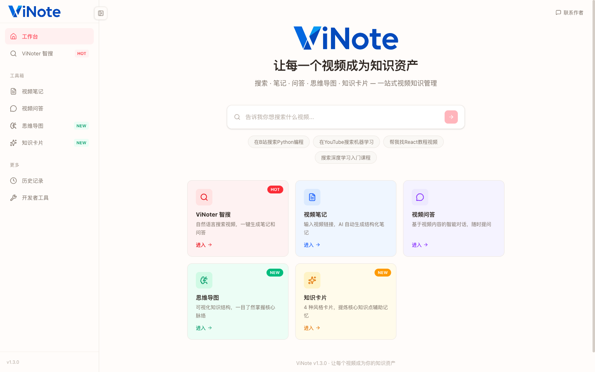

<div align="center">


**ViNote = Video + Note**

**视记AI · 让每个视频成为你的知识资产**

ViNoter · 超级视记Agent

**Video to Everything：笔记、问答、文章、字幕、卡片、导图，一应俱全**

[](https://www.python.org/downloads/)
[](https://fastapi.tiangolo.com/)
[](https://opensource.org/licenses/MIT)
</div>

---



## ✨ 核心特性

### 🤖 ViNoter 超级智能体 🔥
- **对话式操作**: 通过自然语言搜索视频、选择结果并生成笔记
- **工具编排**: 基于 DeepSeek Harness SDK 调用视频搜索和笔记工具，复用现有模型配置
- **跨平台搜索**: 支持 B站和 YouTube 视频检索、连续翻页
- **流程串联**: 搜索 → 选择视频 → 生成笔记，完成后保存到历史记录并支持全文搜索
- **会话恢复**: 对话、当前视频列表和翻页条件保存在 SQLite，刷新页面或重启服务后可继续提问


### 🎯 智能视频处理
- **多平台支持**: YouTube, Bilibili等主流视频平台
- **本地视频支持**: 支持本地视频文件路径输入（MP4, AVI, MOV, MKV等格式）
- **高质量转录**: 基于 Faster-Whisper 的本地音频转录
- **智能优化**: AI驱动的文本优化和格式化
- **多语言支持**: 自动检测语言并支持翻译

### 📝 笔记生成
- **结构化输出**: 自动生成大纲、要点和总结
- **Markdown格式**: 完美支持各类笔记软件
- **实时进度**: SSE实时推送处理进度
- **合集批处理**: 可展开 B站/YouTube 合集，勾选最多 20 个视频复用批处理队列
- **产物重生成**: 历史记录中可重新整理笔记，或单独重做摘要和思维导图

### 🤖 视频问答
- **智能问答**: 基于视频内容的AI问答系统
- **上下文理解**: 深度理解视频内容
- **流式输出**: 实时响应，提升用户体验
- **存量内容复用**: 从历史记录勾选 1-5 条原文或笔记直接发起问答
- **会话持久化**: 问答来源和对话消息保存在 SQLite，刷新页面后可继续

### 🎬 视频下载
- **多格式支持**: 支持多种视频格式和分辨率
- **预览功能**: 下载前预览视频信息
- **进度跟踪**: 实时显示下载进度

### 🃏 知识卡片
- **一键生成**: 从视频笔记自动提取核心知识点
- **多种风格**: 支持概念卡、要点卡、对比卡等多种卡片类型
- **AI 提炼**: 智能提炼关键信息，适合快速复习

### 🧠 思维导图
- **自动生成**: 从笔记内容自动构建思维导图
- **交互式浏览**: 基于 Markmap 的可缩放、可折叠导图
- **一键导出**: 支持导出为图片

### 📂 笔记分类与标签
- **分类管理**: 17 个预置系统分类 + 自定义分类，笔记一目了然
- **标签系统**: AI 自动打标签 + 手动编辑，灵活组织知识
- **交叉筛选**: 按分类、标签、关键词多维度快速检索
- **全文搜索**: 关键词可匹配标题、原始转录、整理笔记和摘要；旧笔记启动后自动建立索引

### 💾 SQLite 持久化存储
- **可靠存储**: 已完成笔记存入 SQLite，告别 JSON 文件丢失风险
- **自动迁移**: 首次启动自动将旧 JSON 数据迁移到 SQLite
- **服务端分页**: 历史记录支持分页、排序、筛选，大量笔记也不卡顿

### 🗄️ 存储管理
- **可视化统计**: 一键查看笔记、音频缓存、下载文件占用空间
- **分类清理**: 按类型清理缓存，释放磁盘空间

---

## 🚀 快速开始

### 启动前：配置大模型

两种安装方式都读取项目根目录的 `.env`。从 [.env.example](.env.example) 复制后，填写你自己的三个配置项：

```dotenv
OPENAI_API_KEY=your-api-key
OPENAI_BASE_URL=https://api.openai.com/v1
OPENAI_MODEL=gpt-4o
```

以上密钥是占位符，地址和模型是公开示例，需替换为你自己的可用配置。`OPENAI_BASE_URL` 填服务商提供的 API 根地址，不要填写完整的 `/chat/completions` 路径；是否需要 `/v1` 以服务商说明为准。`OPENAI_MODEL` 必须是该密钥有权限使用的准确模型 ID。

ViNoter 智搜要求模型同时支持 **OpenAI-compatible Chat Completions、流式输出和自动工具调用**；普通聊天能回答，不代表工具调用一定可用。不需要额外配置 DeepSeek 账号。首次运行可保留默认 `ASR_PROVIDER=whisper`、`ASR_MODEL=` 和 CPU 配置。

`OPENAI_API_KEY` 留空仍可打开基础界面，但不能使用对话式智搜及完整 AI 生成能力。修改配置后请重启本地服务；Docker 使用 `docker compose up -d --build` 重新创建服务。不要将真实 `.env`、密钥或 Cookie 提交到仓库。

### 🐳 方式一：Docker 部署（推荐）

Docker 方式不需要在宿主机安装 Python、Node.js 或 FFmpeg。

这是单用户工具，没有账号权限隔离。默认只监听本机；不要直接暴露到公网。需要可信局域网或反向代理访问时，可在 `.env` 设置 `APP_BIND_HOST=0.0.0.0`（Docker），把实际访问域名/IP加入 `ALLOWED_HOSTS`（默认 `localhost,127.0.0.1,::1`），并在入口配置访问控制；跨域前端需把准确来源加入 `CORS_ORIGINS`。

```bash
git clone https://github.com/zrt-ai-lab/ViNote.git
cd ViNote

cp .env.example .env
# 编辑 .env，按上面的说明填写自己的模型配置后继续。

docker compose up -d --build
docker compose ps
```

等待服务就绪后，在浏览器打开 <http://localhost:8999>；健康检查见下方“启动检查”。

常用 Docker 命令：

```bash
docker compose logs -f
docker compose down
docker compose up -d --build
```

B站 Cookie 是可选能力。需要使用自己账号的登录状态时，按下文配置 `bilibili_cookies.txt`，再取消 `docker-compose.yml` 中这行注释，并重新创建服务：

```yaml
# - ./bilibili_cookies.txt:/app/bilibili_cookies.txt:ro
```

---

### 🛠️ 方式二：本地安装

本地一键脚本会自动安装后端依赖、安装前端依赖、构建前端并启动服务。首次运行如果没有 `.env`，脚本会复制示例文件后停止，让你先完成配置。

默认安装基础服务、Agent SDK 和 Whisper 依赖，不安装 FunASR/Qwen3 扩展。选择 `ASR_PROVIDER=funasr` 或 `qwen3` 时，启动脚本会自动安装对应扩展；切换配置后重新运行脚本即可。前端依赖、源代码和构建产物未变时，脚本跳过重复安装/构建。Docker Compose 同样按 `.env` 选择扩展，切换后执行 `docker compose up -d --build`。

`ASR_MODEL` 留空时自动使用对应 provider 的默认模型。升级已有 `.env` 或切换 provider 时，请清空旧模型名（例如 Whisper 的 `base`），或同时填写目标 provider 支持的模型名。

#### 前置要求

- Python 3.10+
- uv 包管理器
- FFmpeg
- Node.js 20.19+ 或 22.12+（Vite 7 要求；Node 21 不支持）

安装示例：

```bash
# macOS
brew install python@3.12 ffmpeg node
curl -LsSf https://astral.sh/uv/install.sh | sh

# Ubuntu/Debian
sudo apt-get update
sudo apt-get install -y python3 ffmpeg
curl -LsSf https://astral.sh/uv/install.sh | sh
# Node.js 单独安装满足上述版本要求的版本；系统软件源中的 nodejs 可能过旧。

# Windows PowerShell
powershell -c "irm https://astral.sh/uv/install.ps1 | iex"
# Python、FFmpeg 和 Node.js 请使用官方安装包，并加入 PATH。
```

安装后重新打开终端，确认 `python3 --version`（Windows 为 `python --version`）、`uv --version`、`ffmpeg -version`、`node --version`、`npm --version` 均可执行。

启动：

```bash
git clone https://github.com/zrt-ai-lab/ViNote.git
cd ViNote

# macOS / Linux
./start.sh

# Windows PowerShell
.\start.bat
```

首次运行生成 `.env` 后，按“启动前：配置大模型”填写配置，再执行同一个启动命令。保持该终端运行，在浏览器打开 <http://localhost:8999>；按 `Ctrl+C` 停止服务。

手动启动只建议用于开发排查：

```bash
uv sync --frozen
npm --prefix web ci
npm --prefix web run build
uv run --no-sync uvicorn backend.main:app --host 127.0.0.1 --port 8999 --workers 1
```

当前任务状态和 SSE 连接保存在单进程内存中，生产运行也保持 `--workers 1`。

视频笔记任务支持刷新后查询进度，问答页面可直接打开最近会话。**Agent 对话流断开会取消当前轮次，服务端重启也不会自动续跑未完成任务**；已保存的笔记、问答历史和智搜会话仍可读取，中断的任务需要重新提交。

手动安装可选扩展时使用 `uv sync --frozen --extra funasr`、`--extra qwen3`，随后用 `uv run --no-sync uvicorn ...` 保留已选扩展。默认 `uv sync` 会回到基础依赖集合。

YouTube 下载所需的 Deno JavaScript 运行时和 yt-dlp EJS 组件随 Python 依赖自动安装，无需另外配置系统 Node.js。首次安装会下载运行时；Docker 镜像使用同一份锁定依赖，并在构建时检查 Deno 可执行文件。

如果使用支持 `reasoning_effort` 的推理模型，整理笔记时出现“输出被截断或预算耗尽”，可以在 `.env` 添加 `OPENAI_REASONING_EFFORT=low` 后重启。该配置只用于笔记整理、翻译、摘要和导图；不设置时不发送此字段，不改变其他模型的默认行为。是否支持该参数取决于模型和网关，不支持时应删除该配置。原始转录和降级提示会保留，不会自动扩大输出预算。

默认使用 Whisper `base` 模型。需要更高转写质量时，可设置 `ASR_MODEL=small` 或更大的模型，同时预留更多内存和处理时间；首次运行会下载对应模型。转录和 AI 生成内容可能存在识别或理解误差，重要信息请核对原视频。

### 启动检查

1. 在另一个终端执行 `curl -f http://localhost:8999/health`（Windows PowerShell 使用 `curl.exe`）。修改过端口时替换 `8999`，确认服务已启动。
2. 打开 <http://localhost:8999>，进入 **“ViNoter 智搜”**，输入“在 YouTube 和 B站搜索 Python 入门，每个平台 2 条”。
3. 选择一个可访问的短视频生成笔记，完成后下载 Markdown，或在“历史记录”中查看。遇到错误时参考下方“故障排查”。

---

## 📖 使用指南

### ViNoter 智搜

ViNoter 使用 [DeepSeek Harness Python SDK](https://github.com/deepseek-ai/deepseek-harness) 编排搜索和笔记工具，YouTube 使用 [yt-dlp Python SDK](https://github.com/yt-dlp/yt-dlp#embedding-yt-dlp)，B站使用公开搜索接口。不需要手动启动额外服务，也不需要另配 DeepSeek 账号；搜索、问答和笔记继续共用 `.env` 中的 `OPENAI_API_KEY`、`OPENAI_BASE_URL`、`OPENAI_MODEL`。

模型接口须支持 OpenAI-compatible Chat Completions、流式输出和自动工具调用。SDK 当前锁定 `0.1.2rc1` 预发布版，依赖安装时会一并安装对应的运行时，不使用系统 Node.js 运行 Agent。

- 搜索支持 `youtube`、`bilibili` 或两者同时；默认每个平台 5 条，可要求 1–20 条、第 1–10 页，关键词最多 200 字。上游实时排序可能变化，不保证跨次翻页绝无重复。
- 对话文字、最新视频列表和翻页条件保存在本地 SQLite；刷新页面或重启服务后可继续当前会话。清空会话会停止正在运行的 Agent 并清除上下文。浏览器仅保存会话 ID，历史最多保留 40 条消息，送给模型的是最近 10 条的有界上下文。
- 单轮最多 8 次模型步骤、10 分钟；最多同时执行 2 个 Agent。关闭流式请求会取消其运行，不会自动续跑中断任务。
- B站搜索默认尝试公开访客会话，不读取浏览器 Cookie。遇到平台限制时，稍后重试或按下文配置自己的有效 Cookie；不保证能解除平台限制。某个平台失败会明确提示，仍可显示另一平台的结果。
- 关键词检索目前只开放 YouTube 和 B站。其他站点的视频链接仍走原有视频转笔记入口，是否能提取由 yt-dlp、站点权限和网络决定，不能把支持下载等同于支持关键词搜索。

#### 使用方式

1. 在左侧导航打开 **“ViNoter 智搜”**（`/search`）。
2. 输入搜索需求，例如“在 B站搜索 Python 入门，返回 5 条”或“在 YouTube 和 B站搜索机器学习入门，每个平台 2 条”。结果以实际返回的视频卡片为准，可能少于请求数量。
3. 输入“下一页，条件不变”继续检索；“第一个”等序号始终指向**最近一次成功搜索的视频列表**，翻页后会更新。
4. 点击视频卡片上的“生成笔记”，或输入“选第一个，帮我生成笔记”。对话工具默认生成中文笔记；其他语言通过“视频笔记”页面选择，不将智搜当作通用翻译助手。
5. 生成完成后可查看或下载 Markdown；成功入库的笔记也会出现在“历史记录”，并纳入全文搜索。若界面提示“未保存到笔记库”，请先下载结果，不要把生成文件等同于保存成功。

点击“清空对话”会取消当前会话任务并清除智搜上下文，不删除已入库的笔记。清空失败会保留当前界面并提示原因；若提示清理未完成，请重启服务后重试。

#### 当前架构

| 层级 | 职责 |
|------|------|
| React 页面 + FastAPI/SSE | 用户操作、视频卡片、实时进度及会话恢复 |
| DeepSeek Harness SDK | 模型调用与工具编排，只开放 `video_search`、`generate_notes` 两个业务工具 |
| 搜索服务 | yt-dlp Python SDK 检索 YouTube，公开接口检索 B站，合并可用结果并报告失败 |
| 笔记服务 | 复用现有字幕优先、ASR、笔记生成流程，保存 Markdown 并建立全文索引 |
| SQLite | 保存笔记、分类标签、问答会话与智搜上下文，不负责重启后续跑任务 |

本地数据库位于 `temp/vinote.db`，笔记文件也保存在 `temp/`。备份前先停止服务并保留整个目录；Docker 使用持久化卷，更新时不要使用 `docker compose down -v` 删除数据。浏览器只保存当前智搜会话 ID，清除浏览器站点数据后不会自动找回这个会话入口。
### 视频转笔记

1. 打开应用首页，选择"视频笔记"
2. 在输入框中粘贴视频链接（YouTube, Bilibili 等）或本地文件路径
   - 系统自动识别在线 URL 或本地文件，无需手动切换
3. 点击"预览"查看视频信息
4. 选择摘要语言（中文/英文/日语等11种语言）
5. 点击"生成笔记"
6. 等待处理完成（可查看实时进度）
7. 下载生成的 Markdown 笔记

> 💡 **支持的视频格式**：MP4, AVI, MOV, MKV, MP3, WAV 等
>
> 💡 **批量模式**：切换到“批量”模式，可扫描本地目录、粘贴多个链接，或粘贴一个 B站/YouTube 合集链接后点击“解析合集/播放列表”，勾选本次需要处理的视频（最多 20 个）。

### 视频问答

1. 打开应用首页，选择"视频问答"
2. 即时问答：粘贴视频链接或本地文件路径，点击“开始预处理”，完成后输入问题
3. 存量问答：进入“历史记录”，勾选 1-5 条笔记，点击“基于所选内容问答”
4. 存量问答会话会自动保存；刷新带 `sessionId` 的问答页面即可恢复来源和消息

> 💡 **提示**：AI 会基于所选内容回答；存量问答默认优先读取原始转录，旧笔记没有原始转录索引时使用完整笔记。

### 重新生成笔记产物

在“历史记录”中，每条笔记提供两种操作：

- **重做摘要**：复用现有完整笔记，重新生成摘要和思维导图
- **重做笔记**：优先从原始转录重新整理完整笔记，再依次生成摘要和思维导图；旧数据没有原始转录索引时会回退到现有完整笔记

### 视频下载

1. 选择"视频下载"标签
2. 粘贴视频链接并点击"预览"
3. 选择想要的视频质量
4. 点击"开始下载"
5. 下载完成后保存文件

---

## 🔧 配置说明

### 环境变量

| 变量名 | 说明 | 默认值                         | 必需 |
|--------|------|-----------------------------|------|
| `APP_HOST` | 服务监听地址；需要局域网访问时可设为 `0.0.0.0` | `127.0.0.1` | 否 |
| `APP_BIND_HOST` | 仅 Docker：宿主机端口绑定地址；不是容器内监听地址 | `127.0.0.1` | 否 |
| `APP_PORT` | 服务端口 | `8999` | 否 |
| `ALLOWED_HOSTS` | 允许的访问域名/IP，逗号分隔，不含协议和端口；局域网或反向代理访问需添加实际值 | `localhost,127.0.0.1,::1` | 否 |
| `CORS_ORIGINS` | 跨域开发来源，逗号分隔；生产构建默认同源 | `http://localhost:5173,http://127.0.0.1:5173` | 否 |
| `OPENAI_API_KEY` | OpenAI 兼容 API 密钥；为空时可打开基础界面，但智搜及完整 AI 生成能力不可用 | 空 | AI 功能需要 |
| `OPENAI_BASE_URL` | OpenAI 兼容 API 地址 | `https://api.openai.com/v1` | 否 |
| `OPENAI_MODEL` | 使用的 LLM 模型 | `gpt-4o` | 否 |
| `ASR_PROVIDER` | ASR 引擎，可选 `whisper`、`funasr`、`qwen3` | `whisper` | 否 |
| `ASR_MODEL` | ASR 模型；留空按 provider 选择 | 空（Whisper 默认 `base`） | 否 |
| `ASR_MODEL_SOURCE` | 模型下载源，可选 `huggingface`、`modelscope` | `huggingface` | 否 |
| `ASR_MODEL_DIR` | 本地模型目录；设置后优先使用本地模型 | 空 | 否 |
| `ASR_DEVICE` | ASR 运行设备，例如 `cpu`、`cuda:0`、`mps` | `cpu` | 否 |
| `ASR_COMPUTE_TYPE` | ASR 计算精度，例如 `int8`、`float16`、`bfloat16` | `int8` | 否 |
| `ASR_MAX_INPUT_SECONDS` | 单个音频切片最大长度 | `60` | 否 |
| `ASR_MAX_INFERENCE_BATCH_SIZE` | ASR 推理批大小 | `1` | 否 |
| `BATCH_CONCURRENCY` | 批量任务并发数 | `5` | 否 |
| `ASR_CONCURRENCY` | ASR 转录并发数 | `1` | 否 |
| `WHISPER_MODEL_SIZE` | 旧版兼容字段；显式设置后仅在 `ASR_PROVIDER=whisper` 时覆盖 `ASR_MODEL` | 注释状态 | 否 |

### 故障排查

| 现象 | 处理方式 |
|------|----------|
| 首次运行脚本后停止 | 这是预期行为。脚本已创建 `.env`，编辑后再次运行 |
| 健康检查成功，但 AI 功能失败 | `/health` 不检查模型；核对 Key、Base URL、模型 ID 和账号权限，修改后重启服务 |
| 普通聊天可用，但智搜失败 | 确认该模型/网关支持流式 Chat Completions 和自动工具调用，而不只是普通文本对话 |
| 安装脚本提示 Python/Node 版本不符 | 检查实际终端中的版本及 PATH，安装满足要求的版本后重新打开终端 |
| 端口 8999 被占用 | 停止占用进程，或修改 `.env` 中的 `APP_PORT` |
| 局域网访问提示 Host 不允许 | 将实际访问域名/IP 加入 `ALLOWED_HOSTS`；本地调整 `APP_HOST`，Docker 调整 `APP_BIND_HOST` |
| 首次 ASR 很慢 | Whisper/FunASR/Qwen3 模型可能需要首次下载 |
| B站 HTTP 412、YouTube 验证要求或部分搜索失败 | 检查服务所在环境的网络、访问权限和平台限流；B站可按需配置自己的有效 Cookie，不保证所有内容可访问 |
| 刷新后历史还在，但当前 Agent 不再执行 | 对话流关闭会取消该轮次；恢复会话后重新发送请求，不会自动续跑 |
| 笔记已生成但提示未入库 | 先下载 Markdown，再检查磁盘空间、目录写权限和数据库状态 |

### Whisper 模型选择

| 模型 | 参数量 | GPU 显存需求 (fp16) | CPU 内存需求 (int8) | 相对速度 | 质量 | 推荐场景 |
|------|--------|---------------------|---------------------|----------|------|----------|
| `tiny` | 39M | ~1GB | ~600MB | ⚡⚡⚡⚡⚡ | ⭐⭐ | 快速测试、实时转录 |
| `base` | 74M | ~1GB | ~800MB | ⚡⚡⚡⚡ | ⭐⭐⭐ | 平衡首选 ✅ |
| `small` | 244M | ~2GB | ~1.5GB (1477MB) | ⚡⚡⚡ | ⭐⭐⭐⭐ | 中等质量 |
| `medium` | 769M | ~3-4GB | ~2.5GB | ⚡⚡ | ⭐⭐⭐⭐ | 高质量 |
| `large-v1` | 1550M | ~4.5GB | ~3GB | ⚡ | ⭐⭐⭐⭐⭐ | 最高质量 (旧版) |
| `large-v2` | 1550M | ~4.5GB (4525MB) | ~2.9GB (2926MB int8) | ⚡ | ⭐⭐⭐⭐⭐ | 最高质量 |
| `large-v3` / `large` | 1550M | ~4.5GB | ~3GB | ⚡ | ⭐⭐⭐⭐⭐ | 最高质量 (推荐) |

### 🍪 Cookies 配置（B站，可选）

公开搜索和公开视频可先不配置 Cookie。遇到需要登录的视频或平台访问限制时，可使用自己账号的 B站 Cookie 重试；Cookie 不保证解除限流，也不会增加账号本来没有的观看权限。

YouTube 搜索当前使用公开访问方式，不读取浏览器 Cookie；登录要求、地区限制和平台风控仍可能导致请求失败。`bilibili_cookies.txt` 只用于 B站。

#### 方法一：仅导出 B站域名的 Cookie

1. 在浏览器中登录自己的 B站账号。
2. 使用可信且支持 **Netscape 格式、仅导出当前站点** 的 Cookie 工具，只导出 `bilibili.com` 及其子域的条目，不导出整个浏览器的 Cookie。
3. 将文件保存到项目根目录，命名为 `bilibili_cookies.txt`。保留实际的域名、路径、过期时间和制表符分隔格式，不要保存为 JSON。
4. 重启 ViNote 后重试。Docker 部署还需启用前文的只读 Cookie 文件挂载。

#### 方法二：使用格式示例手动填写

```bash
cp cookies.txt.example bilibili_cookies.txt
```

参考示例中的 Netscape 字段格式，从本人已登录的 B站浏览器会话填写实际条目，移除对应行开头的注释符，并替换占位值和过期时间。仅复制示例文件不能获得有效登录状态，不要加入其他网站的 Cookie。

`bilibili_cookies.txt` 包含登录凭据，只保留在本机；不要提交到 Git、公开分享或发送给大模型。Cookie 的有效期由平台和登录状态决定，失效后重新登录、导出并重启服务。


---


## 📋 版本更新

### 当前开发版本（未发布）

- ViNoter 使用 DeepSeek Harness SDK 编排搜索与笔记工具，沿用现有 OpenAI 兼容模型配置。
- YouTube 检索接入 yt-dlp Python SDK；B站支持公开访客会话和可选登录 Cookie，支持双平台搜索及连续翻页。
- 智搜会话保存到 SQLite，支持刷新恢复、重启后继续提问和清空会话。
- Agent 生成的笔记保存到历史记录与全文索引；保存失败保留下载入口并提示原因。
- 修复并发消息、笔记进度串位及取消/清空时的状态竞争。
- 修复 YouTube 音频下载的过时客户端参数，改用 yt-dlp 默认选择并补齐 JavaScript 运行依赖。
- 加强笔记、摘要、翻译和导图的原文约束，短内容不再要求扩写；空响应最多重试一次，降级保留原文并显示警告。并发笔记任务的警告状态独立。
- 新增可选 `OPENAI_REASONING_EFFORT`，支持为兼容的推理模型配置内容生成强度；默认不发送此参数。截断正文、拒答或输出预算耗尽会显示降级提示，不会自动增加 token 预算。

### v1.4.0 (2026-03-09) 🚀 SQLite 持久化 + 分类管理 + UI 大优化

#### 💾 SQLite 持久化存储
- ✅ **已完成笔记迁移到 SQLite**: 告别 JSON 文件，数据更可靠
- ✅ **自动迁移**: 首次启动自动将 `tasks.json` + `tags.json` 迁移到 SQLite
- ✅ **4 张表设计**: notes, categories, tags, note_tags（多对多）
- ✅ **服务端分页/筛选/排序**: 历史记录 API 全面升级

#### 📂 分类与标签系统
- ✅ **笔记分类页面**: 独立的分类管理页面，左侧分类列表 + 右侧关联笔记
- ✅ **17 个预置系统分类**: 开箱即用的笔记分类体系
- ✅ **分类 CRUD**: 新建、重命名、删除分类
- ✅ **标签系统**: AI 自动打标签 + 手动编辑，标签芯片可跳转筛选
- ✅ **交叉筛选**: 按分类、标签、关键词多维度快速检索

#### 🗄️ 存储管理
- ✅ **存储统计面板**: 可视化查看笔记、音频缓存、下载文件、备份占用空间
- ✅ **分类清理**: 按类型一键清理缓存，释放磁盘空间
- ✅ **单条删除**: 支持删除单条笔记及其关联文件

#### 🎨 UI 优化
- ✅ **输入框合并**: 视频笔记/问答/思维导图页面去掉"在线/本地"切换，合并为单输入框，自动识别
- ✅ **批量处理**: 视频笔记支持批量模式，可扫描本地目录或粘贴多个链接
- ✅ **历史记录重写**: 服务端分页、行内分类下拉、行内标签编辑
- ✅ **short_id 修复**: 修复历史记录内容查看/跳转卡片/导图失败的问题
- ✅ **启动时自动修复**: `repair_note_file_links()` 修复历史数据中的文件链接

#### 🔧 修复
- ✅ 修复 short_id 双源不匹配导致历史记录功能异常
- ✅ 修复 `ai_config.openai_model` 属性访问错误
- ✅ 本地路径防御统一到 3 个路由（tasks/qa/mindmap）

---

### v1.3.1 (2026-02-26) 🚀 字幕优先 + Docker 部署

#### ⚡ 性能优化
- ✅ **字幕优先策略**: 视频处理时优先提取平台字幕（B站AI字幕、内嵌字幕等），跳过音频下载和ASR转录
- ✅ **处理速度大幅提升**: 有字幕的视频从 3-5 分钟缩短到 10 秒内完成
- ✅ **节省资源**: 无需下载音频文件，无需 GPU/CPU 进行语音识别

#### 🐳 Docker 部署
- ✅ **Docker 支持**: 新增 `Dockerfile` 多阶段构建（前端+后端）
- ✅ **Docker Compose**: 一键部署，自动管理卷和健康检查
- ✅ **优化镜像**: `.dockerignore` 排除敏感文件和无关文件

#### 🎨 前端优化
- ✅ **智能进度展示**: 字幕流程和转录流程显示不同的步骤标签
- ✅ **步骤自动切换**: 自动识别后端字幕提取成功信号，切换进度展示

#### 🔧 修复
- ✅ 修复 SearchAgent 页面变量声明顺序 ESLint 错误
- ✅ 统一所有视频入口（笔记/问答/思维导图）的字幕优先逻辑

---

### v1.3.0 (2026-02-14) 🎉 架构重构 + 新功能

#### 🏗️ 架构重构
- **后端模块化**: 拆分 1600+ 行 main.py → `routers/` + `core/` 分层架构
- **前端工程化**: 从原生 HTML/JS 迁移至 React + TypeScript + Vite

#### 🚀 新功能
- ✅ **知识卡片**: 从笔记一键生成知识卡片，支持多种卡片风格
- ✅ **思维导图**: 基于 Markmap 的交互式思维导图，从笔记自动生成
- ✅ **历史记录**: 笔记任务历史查看与管理
- ✅ **优化一键启动脚本**: `start.sh` / `start.bat` 自动安装依赖、构建前端、检测端口


### v1.2.0 (2025-11-03) 🎉 重大更新

#### 🚀 新功能

**1. ViNoter 超级智搜模块** ⭐⭐⭐⭐⭐
- ✅ 对话式检索网站视频（支持 B站、YouTube 等）
- ✅ 对话式视频转录，转录完成可直接下载
- ✅ 智能理解用户意图，自动调用相应工具
- ✅ 流式对话体验，实时反馈处理进度

**2. 转录进度优化** 📊
- ✅ 后端增加详细转录进度跟踪
- ✅ 实时进度百分比显示
- ✅ 转录状态实时更新

#### 🔧 重要改进

**3. B站视频 412 错误修复** 🛠️
- ✅ 增加 Cookie 认证支持
- ✅ B站使用专用 `bilibili_cookies.txt`
- ✅ 内置开发者工具，方便进行 Cookie 格式转换

### v1.1.0 (2025-01-27)
#### 🎉 新功能
- ✅ **本地视频支持**：支持通过绝对路径输入本地视频文件
  - 支持格式：MP4, AVI, MOV, MKV, MP3, WAV等
  - 支持Mac/Linux/Windows路径
  - Docker环境支持目录挂载
- ✅ **视频笔记本地模式**：可直接处理本地视频生成笔记
- ✅ **视频问答本地模式**：可基于本地视频内容进行智能问答

#### 🔧 改进
- 优化了路径验证逻辑
- 改进了用户界面体验
- 完善了文档说明

### v1.0.0 (2025-01-20)
#### 🎉 初始版本
- ✅ 在线视频下载和转录
- ✅ AI驱动的笔记生成
- ✅ 视频问答系统
- ✅ 视频下载功能
- ✅ 多语言支持
- ✅ 实时进度跟踪

---

## 🗺️ 开发路线图

### ✅ 已完成功能

#### 核心功能
- ✅ 超级视记Agent-ViNoter
- ✅ 视频音频下载和转录
- ✅ AI驱动的笔记生成
- ✅ 文本智能优化
- ✅ 多语言翻译支持
- ✅ 视频问答系统
- ✅ 视频下载功能


### ✅ 已完成模块（8/8）

- ✅ 知识卡片生成（自动提取知识点、多种卡片风格）
- ✅ 思维导图生成（从笔记/视频自动生成）
- ✅ 笔记分类与标签管理
- ✅ SQLite 持久化存储 + 自动迁移

---

## 🤝 贡献指南

欢迎贡献代码！请遵循以下步骤：

1. Fork 本仓库
2. 创建特性分支 (`git checkout -b feature/AmazingFeature`)
3. 提交更改 (`git commit -m 'Add some AmazingFeature'`)
4. 推送到分支 (`git push origin feature/AmazingFeature`)
5. 开启 Pull Request

### 贡献建议
- 📋 查看 [开发路线图](#🗺️-开发路线图) 选择待开发功能
- 🐛 修复 Issues 中的 Bug
- 📝 改进文档和示例
- ✨ 提出新功能建议

---


## 📄 许可证

本项目采用 MIT 许可证 - 查看 [LICENSE](LICENSE) 文件了解详情

---

## 🙏 致谢

本项目基于以下优秀的开源项目和服务构建：

### 核心依赖
- **[DeepSeek Harness SDK](https://github.com/deepseek-ai/deepseek-harness)** - ViNoter 的 Agent 运行时与视频搜索、笔记工具编排
- **[yt-dlp](https://github.com/yt-dlp/yt-dlp)** - 强大的视频下载工具，支持数百个视频平台
- **[Faster-Whisper](https://github.com/SYSTRAN/faster-whisper)** - 高效的 Whisper 实现，提供出色的转录性能
- **[FastAPI](https://github.com/tiangolo/fastapi)** - 现代化的 Python Web 框架，高性能且易用
- **[OpenAI API](https://openai.com/)** - 强大的 AI 文本处理能力

### 灵感来源
- **[AI-Video-Transcriber](https://github.com/wendy7756/AI-Video-Transcriber)** - 一款开源的 AI 视频转录和摘要工具，为本项目提供了重要的设计灵感


感谢所有开源项目的贡献者们！💖

---

## 💬 联系方式

- 问题反馈: [GitHub Issues](https://github.com/zrt-ai-lab/ViNote/issues)
- 邮箱: 864410260@qq.com

---

<div align="center">

**如果这个项目对你有帮助，请给个 ⭐️ Star 支持一下！**

Made with ❤️ by ViNote Team

</div>
