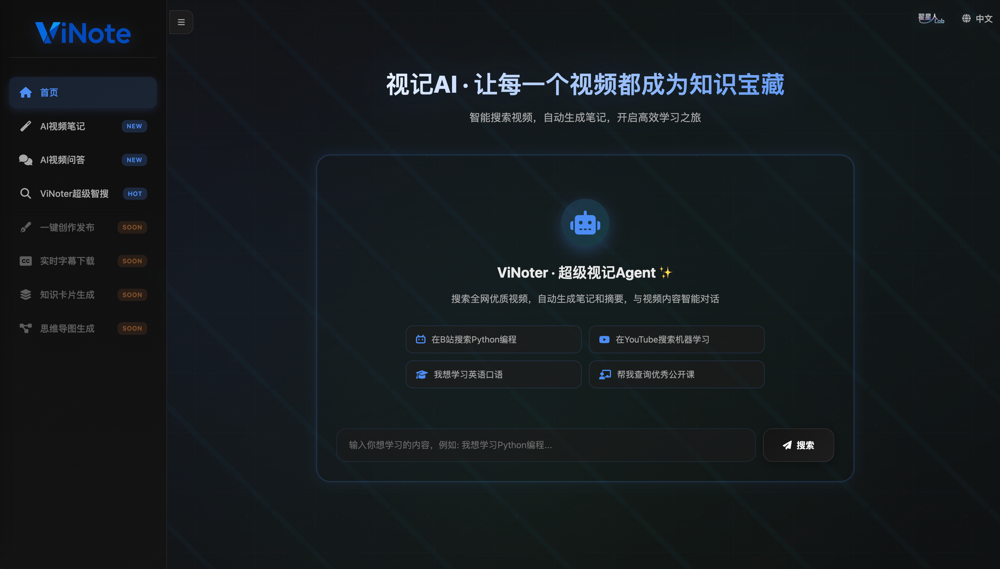

<div align="center">


**ViNote = Video + Note**

视记AI · 让每个视频成为你的知识资产

**Video to Everything：笔记、问答、文章、字幕、卡片、导图，一应俱全**

[](https://www.python.org/downloads/)
[](https://fastapi.tiangolo.com/)
[](https://www.docker.com/)
[](https://opensource.org/licenses/MIT)

[English](README.md) | 中文

</div>

---



## ✨ 核心特性


### 🎯 智能视频处理
- **多平台支持**: YouTube, Bilibili等主流视频平台
- **本地视频支持**: 支持本地视频文件路径输入（MP4, AVI, MOV, MKV等格式）
- **高质量转录**: 基于 Faster-Whisper 的本地音频转录
- **智能优化**: AI驱动的文本优化和格式化
- **多语言支持**: 自动检测语言并支持翻译

### 📝 笔记生成
- **结构化输出**: 自动生成大纲、要点和总结
- **Markdown格式**: 完美支持各类笔记软件
- **实时进度**: SSE实时推送处理进度

### 🤖 视频问答
- **智能问答**: 基于视频内容的AI问答系统
- **上下文理解**: 深度理解视频内容
- **流式输出**: 实时响应，提升用户体验

### 🎬 视频下载
- **多格式支持**: 支持多种视频格式和分辨率
- **预览功能**: 下载前预览视频信息
- **进度跟踪**: 实时显示下载进度

---

## 🚀 快速开始

### 方式一：Docker 部署（推荐）

#### 前置要求
- Docker 20.10+
- Docker Compose 2.0+

#### 部署步骤

1. **克隆项目**
```bash
git clone https://github.com/zrt-ai-lab/ViNote.git
cd ViNote
```

2. **配置环境变量**
```bash
# 复制环境配置文件
cp .env.example .env

# 编辑 .env 文件，填入你的 OpenAI API Key
# OPENAI_API_KEY=your-api-key-here
# OPENAI_BASE_URL=https://api.openai.com/v1
# OPENAI_MODEL=gpt-4o
```

3. **启动服务**
```bash
# 构建并启动
docker-compose up -d

# 查看日志
docker-compose logs -f

# 停止服务
docker-compose down
```

> 💡 **镜像加速提示**：
> 
> 本项目的 Dockerfile 已配置使用清华大学镜像源加速软件包下载：
> - Debian 软件源：`mirrors.tuna.tsinghua.edu.cn`
> 
> 这将大大提升国内用户的构建速度。如果你想使用其他镜像源（如阿里云、中科大等），可以修改 Dockerfile 中的镜像地址。

4. **访问应用**
打开浏览器访问: http://localhost:8000

---

### 方式二：本地开发

#### 前置要求
- Python 3.10+
- FFmpeg（音视频处理）
- uv 包管理器

#### 安装步骤

1. **克隆项目**
```bash
git clone https://github.com/zrt-ai-lab/ViNote.git
cd ViNote
```

2. **安装 uv 包管理器**
```bash
# macOS/Linux
curl -LsSf https://astral.sh/uv/install.sh | sh

# Windows
powershell -c "irm https://astral.sh/uv/install.ps1 | iex"
```

3. **安装 FFmpeg**
```bash
# macOS
brew install ffmpeg

# Ubuntu/Debian
sudo apt-get update && sudo apt-get install ffmpeg

# Windows
# 从 https://ffmpeg.org/download.html 下载并安装
```

4. **安装依赖**
```bash
# 使用 uv 安装依赖（会自动创建 .venv 虚拟环境）
uv pip install -e .

# 或使用 uv sync（推荐）
uv sync
```

5. **配置环境变量**
```bash
cp .env.example .env
# 编辑 .env 文件，填入你的配置
```

6. **启动服务**

有两种方式启动服务：

**方式 1：使用 uv run（推荐，无需激活虚拟环境）**
```bash
# 开发模式（自动重载）
uv run uvicorn backend.main:app --reload --port 8000

# 生产模式
uv run uvicorn backend.main:app --host 0.0.0.0 --port 8000 --workers 4
```

**方式 2：激活虚拟环境后运行**
```bash
# 先激活虚拟环境
source .venv/bin/activate  # macOS/Linux
# 或
.venv\Scripts\activate     # Windows

# 然后启动服务
uvicorn backend.main:app --reload --port 8000
```

7. **访问应用**
打开浏览器访问: http://localhost:8000

---

## 📖 使用指南

### 视频转笔记

#### 方式一：在线视频URL
1. 打开应用首页，选择"AI视频笔记"
2. 在"在线URL"模式下，粘贴视频链接（支持 YouTube, Bilibili 等）
3. 点击"预览"查看视频信息
4. 选择摘要语言（中文/英文/日语等11种语言）
5. 点击"生成笔记"
6. 等待处理完成（可查看实时进度）
7. 下载生成的 Markdown 笔记

#### 方式二：本地视频文件
1. 打开应用首页，选择"AI视频笔记"
2. 切换到"本地路径"模式
3. 输入本地视频文件的绝对路径，例如：
   - Mac/Linux: `/Users/zhangsan/Videos/lecture.mp4`
   - Windows: `C:\Users\zhangsan\Videos\lecture.mp4`
   - Docker: `/app/videos/lecture.mp4`（需要挂载目录）
4. 点击"预览"验证文件
5. 选择摘要语言
6. 点击"生成笔记"
7. 等待处理完成并下载笔记

> 💡 **支持的视频格式**：MP4, AVI, MOV, MKV, MP3, WAV 等

### 视频问答

#### 方式一：在线视频URL
1. 打开应用首页，选择"AI视频问答"
2. 在"在线URL"模式下，粘贴视频链接（支持 YouTube, Bilibili 等）
3. 点击"预览"查看视频信息
4. 点击"开始预处理"按钮
5. 等待AI预处理完成（提取音频并转录）
6. 在输入框中输入您的问题
7. AI将基于视频内容实时回答

#### 方式二：本地视频文件
1. 打开应用首页，选择"AI视频问答"
2. 切换到"本地路径"模式
3. 输入本地视频文件的绝对路径
4. 点击"预览"验证文件
5. 点击"开始预处理"按钮
6. 等待AI预处理完成
7. 在输入框中输入问题，AI实时回答

> 💡 **提示**：预处理完成后，您可以针对视频内容提出任意问题，AI会基于完整的视频内容给出准确回答

### 视频下载

1. 选择"视频下载"标签
2. 粘贴视频链接并点击"预览"
3. 选择想要的视频质量
4. 点击"开始下载"
5. 下载完成后保存文件

---

## 🏗️ 项目架构

```
vinote/
├── backend/              # 后端代码
│   ├── config/          # 配置管理
│   │   ├── ai_config.py      # AI模型配置
│   │   └── settings.py       # 应用设置
│   ├── core/            # 核心功能
│   │   └── ai_client.py      # AI客户端单例
│   ├── models/          # 数据模型
│   │   └── schemas.py        # Pydantic模型
│   ├── services/        # 业务逻辑层
│   │   ├── note_generator.py        # 笔记生成
│   │   ├── content_summarizer.py    # 内容摘要
│   │   ├── text_optimizer.py        # 文本优化
│   │   ├── text_translator.py       # 文本翻译
│   │   ├── audio_transcriber.py     # 音频转录
│   │   ├── video_downloader.py      # 视频下载
│   │   ├── video_preview_service.py # 视频预览
│   │   ├── video_download_service.py # 下载服务
│   │   └── video_qa_service.py      # 视频问答
│   ├── utils/           # 工具函数
│   │   ├── file_handler.py   # 文件处理
│   │   └── text_processor.py # 文本处理
│   └── main.py          # FastAPI应用入口
├── static/              # 前端静态文件
│   ├── index.html       # 主页面
│   ├── app.js          # 前端逻辑
│   └── *.png/jpg       # 图片资源
├── temp/               # 临时文件目录
│   ├── downloads/      # 下载文件
│   └── backups/        # 任务备份
├── .env.example        # 环境变量示例
├── pyproject.toml      # 项目配置（uv）
├── Dockerfile          # Docker镜像配置
├── docker-compose.yml  # Docker编排配置
└── README.md          # 项目文档
```

---

## 🔧 配置说明

### 环境变量

| 变量名 | 说明 | 默认值                         | 必需 |
|--------|------|-----------------------------|------|
| `OPENAI_API_KEY` | OpenAI API密钥 | -                           | ✅ |
| `OPENAI_BASE_URL` | OpenAI API地址 | `https://api.openai.com/v1` | ✅ |
| `OPENAI_MODEL` | 使用的模型 | `gpt-4o`                    | ✅ |
| `WHISPER_MODEL_SIZE` | Whisper模型大小 | `base`                      | ✅ |
| `APP_HOST` | 服务监听地址 | `0.0.0.0`                   | ❌ |
| `APP_PORT` | 服务端口 | `8001`                      | ❌ |
### Whisper 模型选择

| 模型 | 参数量 | GPU 显存需求 (fp16) | CPU 内存需求 (int8) | 相对速度 | 质量 | 推荐场景 |
|------|--------|---------------------|---------------------|----------|------|----------|
| `tiny` | 39M | ~1GB | ~600MB | ⚡⚡⚡⚡⚡ | ⭐⭐ | 快速测试、实时转录 |
| `base` | 74M | ~1GB | ~800MB | ⚡⚡⚡⚡ | ⭐⭐⭐ | 平衡首选 ✅ |
| `small` | 244M | ~2GB | ~1.5GB (1477MB) | ⚡⚡⚡ | ⭐⭐⭐⭐ | 中等质量 |
| `medium` | 769M | ~3-4GB | ~2.5GB | ⚡⚡ | ⭐⭐⭐⭐ | 高质量 |
| `large-v1` | 1550M | ~4.5GB | ~3GB | ⚡ | ⭐⭐⭐⭐⭐ | 最高质量 (旧版) |
| `large-v2` | 1550M | ~4.5GB (4525MB) | ~2.9GB (2926MB int8) | ⚡ | ⭐⭐⭐⭐⭐ | 最高质量 |
| `large-v3` / `large` | 1550M | ~4.5GB | ~3GB | ⚡ | ⭐⭐⭐⭐⭐ | 最高质量 (推荐) |
| `turbo` / `large-v3-turbo` | ~809M | ~3GB | ~2GB | ⚡⚡ | ⭐⭐⭐⭐⭐ | 高质量快速版 |
| `distil-small.en` | ~166M | ~1.5GB | ~1GB | ⚡⚡⚡⚡ | ⭐⭐⭐ | 英文快速转录 |
| `distil-medium.en` | ~394M | ~2.5GB | ~1.8GB | ⚡⚡⚡ | ⭐⭐⭐⭐ | 英文中等质量 |
| `distil-large-v2` | ~756M | ~3.5GB | ~2.5GB | ⚡⚡ | ⭐⭐⭐⭐⭐ | 蒸馏版高质量 |
| `distil-large-v3` | ~756M | ~3.5GB | ~2.5GB | ⚡⚡ | ⭐⭐⭐⭐⭐ | 蒸馏版最新 | 

---

## 🛠️ 开发指南

### uv 包管理器命令

```bash
# 安装依赖
uv sync

# 添加新依赖
uv add package-name

# 添加开发依赖
uv add --dev package-name

# 更新依赖
uv lock --upgrade

# 运行脚本
uv run python script.py
```

### Docker 命令

```bash
# 构建镜像
docker-compose build

# 启动服务
docker-compose up -d

# 查看日志
docker-compose logs -f vinote

# 进入容器
docker-compose exec vinote bash

# 停止服务
docker-compose down

# 完全清理（包括卷）
docker-compose down -v
```

### API 端点

完整 API 文档: http://localhost:8000/docs

主要端点:
- `POST /api/process-video` - 处理视频生成笔记
- `GET /api/task-status/{task_id}` - 查询任务状态
- `GET /api/task-stream/{task_id}` - SSE任务进度流
- `POST /api/video-qa-stream` - 视频问答流式接口
- `GET /api/preview-video` - 预览视频信息
- `POST /api/start-download` - 开始下载视频
- `GET /api/download/{filename}` - 下载生成的文件


---

## 📋 版本更新

### v1.1 (2025-01-27)
#### 🎉 新功能
- ✅ **本地视频支持**：支持通过绝对路径输入本地视频文件
  - 支持格式：MP4, AVI, MOV, MKV, MP3, WAV等
  - 支持Mac/Linux/Windows路径
  - Docker环境支持目录挂载
- ✅ **视频笔记本地模式**：可直接处理本地视频生成笔记
- ✅ **视频问答本地模式**：可基于本地视频内容进行智能问答

#### 🔧 改进
- 优化了路径验证逻辑
- 改进了用户界面体验
- 完善了文档说明

### v1.0 (2025-01-20)
#### 🎉 初始版本
- ✅ 在线视频下载和转录
- ✅ AI驱动的笔记生成
- ✅ 视频问答系统
- ✅ 视频下载功能
- ✅ 多语言支持
- ✅ 实时进度跟踪

---

## 🗺️ 开发路线图

### ✅ 已完成功能

#### 核心功能
- ✅ 视频音频下载和转录
- ✅ AI驱动的笔记生成
- ✅ 文本智能优化
- ✅ 多语言翻译支持
- ✅ 视频问答系统
- ✅ 视频下载功能


### 🚧 待开发模块（4/6）

#### 模块 3️⃣：一键创作发布
- 🔲 视频内容转文章
- 🔲 多平台发布（公众号、知乎、小红书等）
- 🔲 自定义发布模板
- 🔲 图文混排编辑器

#### 模块 4️⃣：实时字幕下载
- 🔲 提取视频字幕
- 🔲 多格式支持（SRT、VTT、ASS等）

#### 模块 5️⃣：知识卡片生成
- 🔲 自动提取知识点
- 🔲 生成学习卡片

#### 模块 6️⃣：思维导图生成
- 🔲 自动生成思维导图
- 🔲 多种导图样式
- 🔲 导出为图片/PDF

---

## 🤝 贡献指南

欢迎贡献代码！请遵循以下步骤：

1. Fork 本仓库
2. 创建特性分支 (`git checkout -b feature/AmazingFeature`)
3. 提交更改 (`git commit -m 'Add some AmazingFeature'`)
4. 推送到分支 (`git push origin feature/AmazingFeature`)
5. 开启 Pull Request

### 贡献建议
- 📋 查看 [开发路线图](#🗺️-开发路线图) 选择待开发功能
- 🐛 修复 Issues 中的 Bug
- 📝 改进文档和示例
- ✨ 提出新功能建议

---


## 📄 许可证

本项目采用 MIT 许可证 - 查看 [LICENSE](LICENSE) 文件了解详情

---

## 🙏 致谢

本项目基于以下优秀的开源项目和服务构建：

### 核心依赖
- **[yt-dlp](https://github.com/yt-dlp/yt-dlp)** - 强大的视频下载工具，支持数百个视频平台
- **[Faster-Whisper](https://github.com/SYSTRAN/faster-whisper)** - 高效的 Whisper 实现，提供出色的转录性能
- **[FastAPI](https://github.com/tiangolo/fastapi)** - 现代化的 Python Web 框架，高性能且易用
- **[OpenAI API](https://openai.com/)** - 强大的 AI 文本处理能力

### 灵感来源
- **[AI-Video-Transcriber](https://github.com/wendy7756/AI-Video-Transcriber)** - 一款开源的 AI 视频转录和摘要工具，为本项目提供了重要的设计灵感


感谢所有开源项目的贡献者们！💖

---

## 💬 联系方式

- 问题反馈: [GitHub Issues](https://github.com/zrt-ai-lab/ViNote/issues)
- 邮箱: 864410260@qq.com

---

<div align="center">

**如果这个项目对你有帮助，请给个 ⭐️ Star 支持一下！**

Made with ❤️ by ViNote Team

</div>
